# c问题

我们写的代码会接触到好几个环境：开发环境、测试环境以及生产环境：

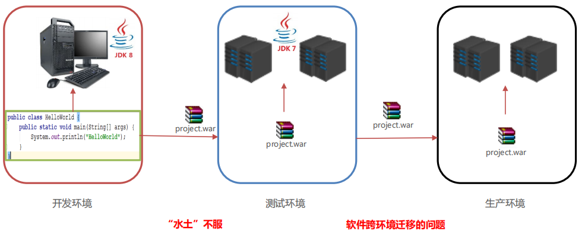

代码换到另外的电脑上，经常会出现环境迁移的问题！！！Docker就是一个容器，可以把我们开发人员的代码环境依赖一起打包，做成一个镜像，然后直接给后面测试运维人员用。就不会再有水土不服的情况。

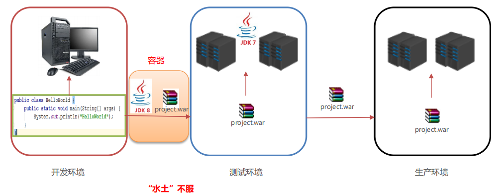

# 简介

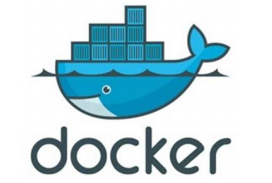

• Docker 是一个开源的应用容器引擎

• 诞生于 2013 年初，基于 Go 语言实现， dotCloud 公司出品（后改名为Docker Inc） 

• **Docker 可以让开发者打包他们的应用以及依赖包到一个轻量级、可移植的容器中，然后发布到任何流行的Linux 机器上。**

• **容器是完全使用沙箱机制，相互隔离**

• 容器性能开销极低。

• Docker 从 17.03 版本之后分为 CE（Community Edition: 社区版） 和 EE（Enterprise Edition: 企业版）

# 架构

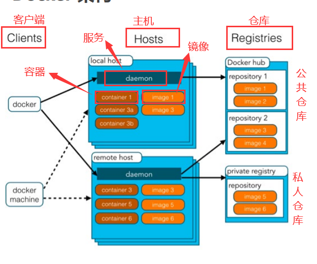

• **镜像（Image）**：Docker 镜像（Image），就相当于是一个 root 文件系统。比如官方镜像 ubuntu:16.04 就包含了完整的一套 Ubuntu16.04 最小系统的 root 文件系统。

• **容器（Container）**：镜像（Image）和容器（Container）的关系，就像是面向对象程序设计中的类和对象一样，镜像是静态的定义，**容器是镜像运行时的实体**。容器可以被创建、启动、停止、删除、暂停等。

• **仓库（Repository）**：仓库可看成一个代码控制中心，用来保存镜像。

# 1、安装

**先要卸载老版本的docker，再安装新的。**

Docker可以运行在MAC、Windows、CentOS、UBUNTU等操作系统上，本课程基于CentOS 7 安装Docker

## 1.1、卸载

1. 查看docker运行状态

```shell
systemctl status docker
```

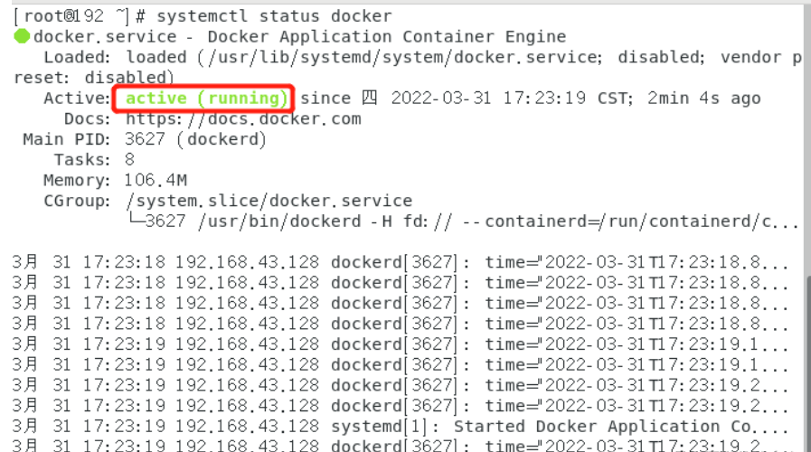

2. 如果显示**active(running)**状态，则表示docker是运行状态，需要执行关闭命令,

```shell
systemctl stop docker
```

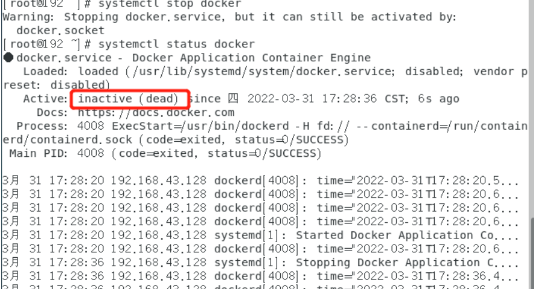

3. 查看yum安装的docker文件包

```shell
yum list installed |grep docker
```

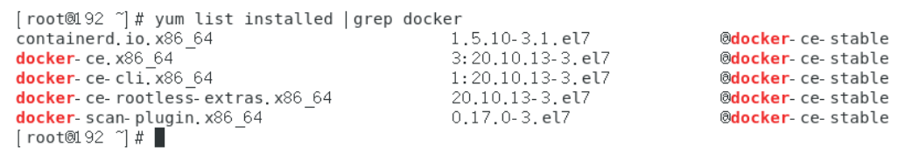

4. 查看docker相关的rmp源文件

``` 
rpm -qa |grep docker
```

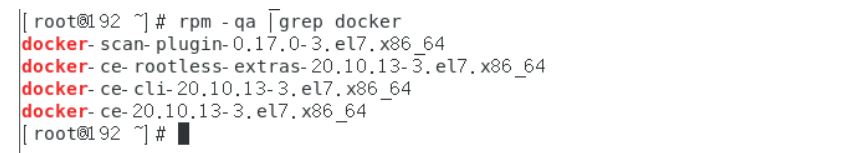

5. 删除第三步找到的所有docker文件包，上面有四个

```
yum -y remove docker版本文件包
 
如图查看yum安装的docker文件包，获取版本号。
```

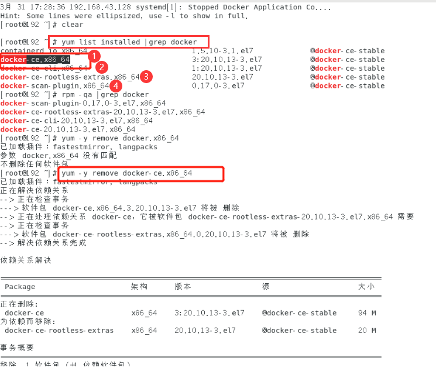

6. 删完之后可以再查看下docker rpm源，直到如图所示

```
rpm -qa |grep docker
```


7. 删除docker的镜像文件，默认在**/var/lib/docker**目录下

```
# cd /var/lib/docker/
# ll
# rm -rf *
# ll
```

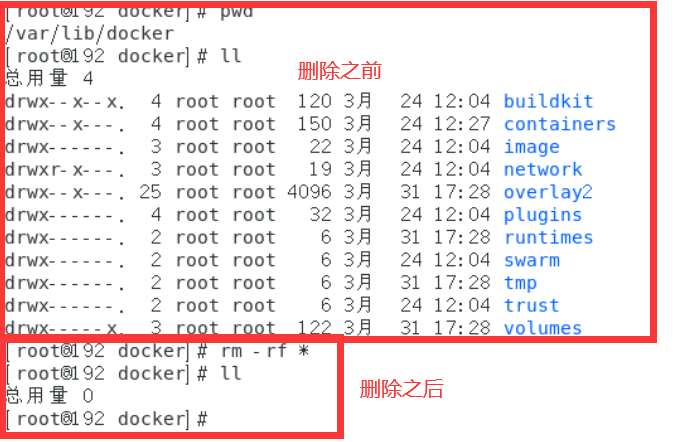

8. 到此docker卸载完毕。

## 1.2、安装

Docker可以运行在MAC、Windows、CentOS、UBUNTU等操作系统上，本课程基于CentOS 7 安装Docker

```shell
# 1、yum 包更新到最新 
yum update
# 2、安装需要的软件包， yum-util 提供yum-config-manager功能，另外两个是devicemapper驱动依赖的 
yum install -y yum-utils device-mapper-persistent-data lvm2
# 3、 设置yum源
yum-config-manager --add-repo https://download.docker.com/linux/centos/docker-ce.repo
# 4、 安装docker，出现输入的界面都按 y 
yum install -y docker-ce
# 5、 查看docker版本，验证是否验证成功
docker -v

```

## 1.3、配置docker镜像

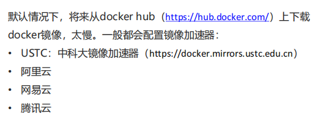

我们使用阿里云的镜像。

1. 登录阿里云完成注册、实名认证等。

2. 如下

   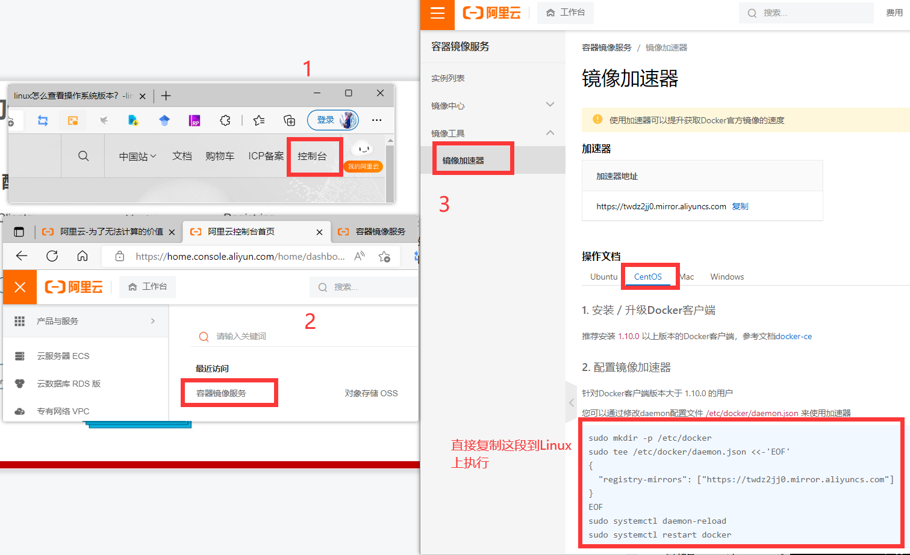

3. 验证是否成功

   ```
   cat /etc/docker/daemon.json
   ```

   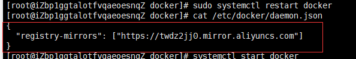

# 2、docker命令

## 2.1、服务命令

-  启动docker服务:

​		`systemctl start docker` 

-  停止docker服务:

​		`systemctl stop docker`

-  重启docker服务:

​		`systemctl restart docker`

-  查看docker服务状态:

​		`systemctl status docker` 

-  设置开机启动docker服务:

​		`systemctl enable docker`

## 2.2、镜像命令

**查看镜像:** 查看本地所有的镜像

```shell
docker images

docker images –q # 查看所用镜像的id
```

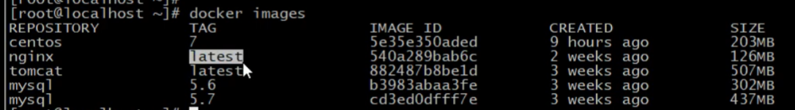

**搜索镜像:** 从网络中查找需要的镜像

```sh
docker search 镜像名称
```

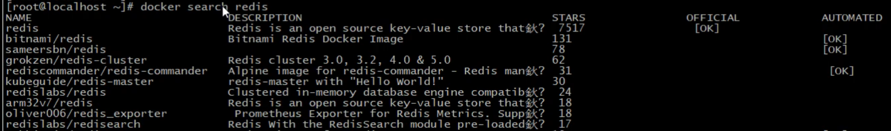

**拉取镜像:** 从Docker仓库下载镜像到本地，镜像名称格式为 名称:版本号,如 `redis:5.2`，如果版本号不指定则是最新的版本。如果不知道镜像版本，可以去`docker hub` 搜索对应镜像查看。

```shell
docker pull 镜像名称
docker pull redis:5.0
```

**删除镜像:** 删除本地镜像

```sh
docker rmi 镜像id #删除指定本地镜像

docker rmi `docker images -q` #删除所有本地镜像
```

## 2.3、容器命令

是通过镜像创建容器，前面说了镜像和容器是类与对象的关系，我们通过Redis镜像创建Redis容器后，容器启动了就相当于启动了我们redis的服务实例。

### **1. 查看容器**

```sh
docker ps #查看正在运行的容器

docker ps –a #查看所有容器(包括已经停止的)
```

### **2. 创建并启动容器**

```sh
docker run 参数 镜像名称:版本

docker run -it --name=test centos:7 /bin/bash  #这个/bin这里是进入后马上执行的命令
docker run -id --name=Redis2 redis:5.0

docker exec -it 容器名称 初始化命令   # 初始化命令可要可不要，有的需要
exit #退出容器
```

**参数说明：**

**• -i：保持容器运行。**通常与 -t 同时使用。加入`-it（-it相当于-t和-i）`这两个参数后，容器创建后自动进入容器中，退出容器后，容器自动关闭。

**• -t：为容器重新分配一个伪输入终端，让他可以接收命令**，通常与 -i 同时使用。

**• -d：以守护（后台）模式运行容器**。创建一个容器在后台运行，需要使用`docker exec` 进入容器。退出后，容器不会关闭。

**• --name：为创建的容器命名**。

• -it 创建的容器一般称为交互式容器，-id 创建的容器一般称为守护式容器

**Example1：交互式容器**

```
docker run -it --name=Myredis redis:5.0
```

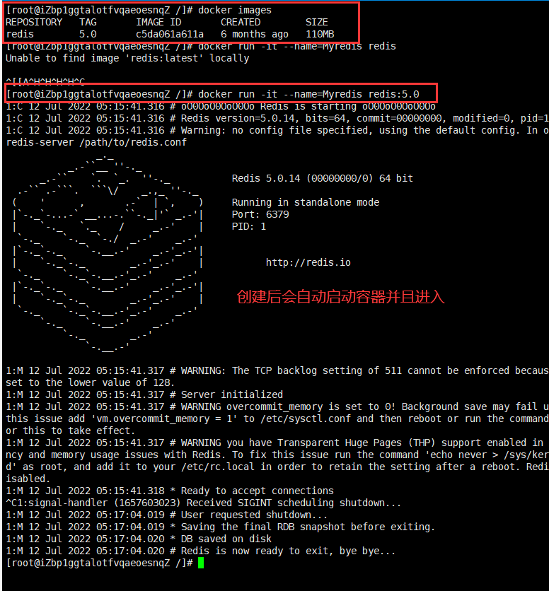

当我们退出容器时，容器就自动销毁了

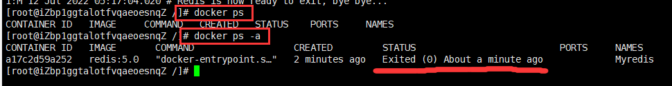

**Example1：守护式容器**

退出之后，容器不会关闭

```
docker run -id --name=Redis2 redis:5.0
```

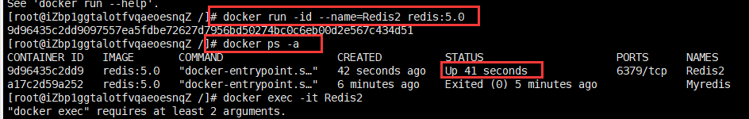

 

### 3. 进入容器

```sh
docker exec 参数  #退出容器，容器不会关闭
docker exec -it c_mysql /bin/bash
```

### 4. 停止容器

```sh
docker stop 容器名称
```

### 5. 启动容器

```sh
docker start 容器名称
```

### 6. 删除容器：

如果容器是运行状态则删除失败，需要停止容器才能删除

```sh
docker rm 容器名称

docker rm `docker ps -aq` # 删除所有容器
```

### 7. 查看容器信息

```sh
docker inspect 容器名称
```

# 3、容器的数据卷

**思考1: Docker 容器删除后，在容器中产生的数据还在吗？**

比如Mysql容器里面加了很多数据，后来容器挂掉了，只能重新创建新的容器，那数据肯定不在了啊

**思考2：Docker 容器和外部机器可以直接交换文件吗？**

外部机器相当于我们的Win，宿主机就是我们Linux服务器，肯定不可以的。

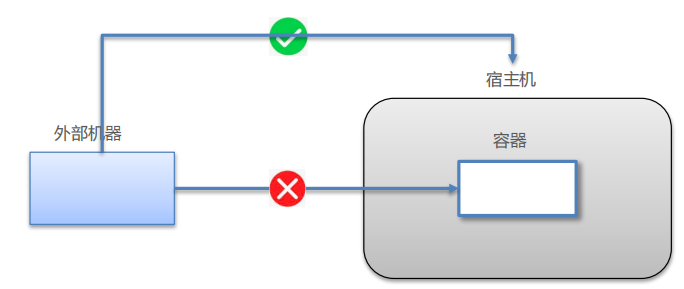

**思考3：容器之间想要进行数据交互？**


## 3.1、简介

**数据卷**

​	• 数据卷是宿主机中的一个目录或文件(被挂载了才算)

​	• 当容器目录和数据卷目录绑定后，对方的修改会立即同步

​	• 一个数据卷可以被多个容器同时挂载

​	• 一个容器也可以被挂载多个数据卷

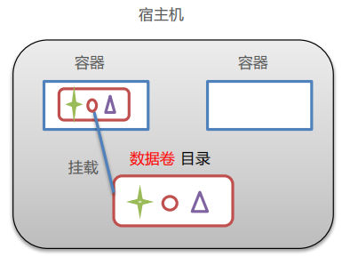

**数据卷作用**

​	• 容器数据持久化（容器挂掉了，我们数据集还是在的）

​	• 外部机器和容器间接通信

​	• 容器之间数据交换

## 3.2、配置数据卷

**创建启动容器时，使用 –v 参数 设置数据卷**

```sh
docker run ... –v 宿主机目录(文件):容器内目录(文件) ...
```

```
docker run -it --name=c1 centos:7 /bin/bash -v /root/data:/root/data_container 
```

**注意事项：**

1. ==目录必须是绝对路径==

2. 如果目录不存在，会自动创建

3. 可以挂载多个数据卷

## 3.3、容器通信

这里实现两个容器挂载同一个数据卷实现两个容器之间的通信。

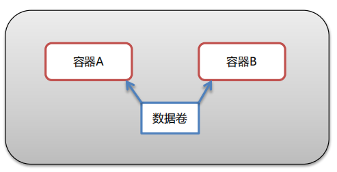

```sh
docker run -it --name=c3 -v /root/data:/root/data centos:7
# 新建一个会话
docker run -it --name=c4 -v /root/data:/root/data centos:7
```

然后我们在c4里面新建一个itcast.txt，然后我们去c3会发现里面也有这个itcast.txt；

## 3.4、数据卷容器

**问题：多容器数据交换？？**

解决办法1：上面的容器通信办法，但不适合容器多的情况；

解决2：数据卷容器

**原理如下：**

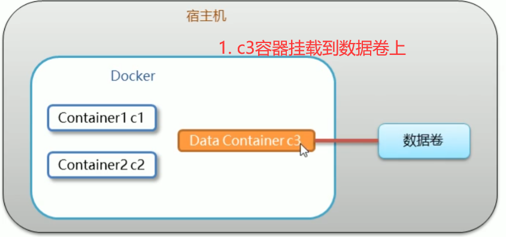

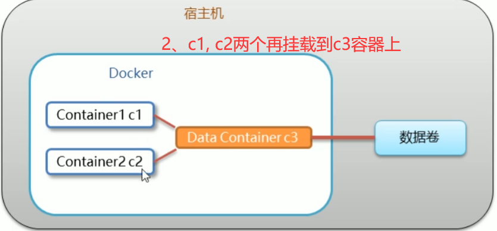

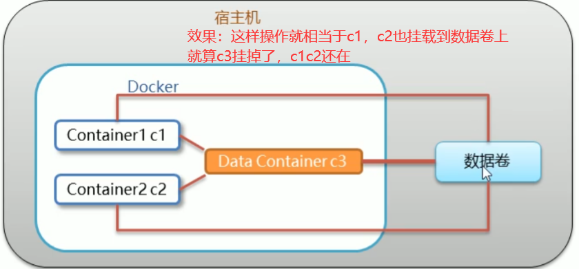

**配置数据卷容器**

1. 创建启动c3数据卷容器，使用 –v 参数 设置数据卷;

   /volume——是容器内的目录

```sh
docker run –it --name=c3 –v /volume centos:7 /bin/bash
```

这里docker或虚拟机会自动给我们创建一个目录，来放数据卷。

通过`docker inspect c3`找到下面这个可以看到宿主机的数据卷

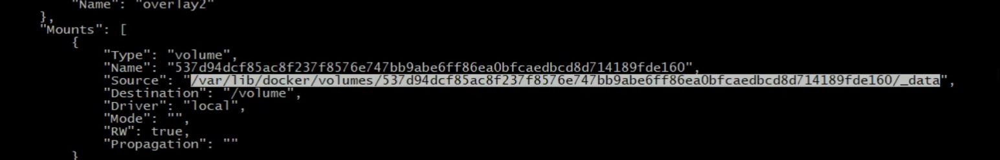

2. 创建启动 c1 c2 容器，使用 –-volumes-from 参数 设置数据卷

```sh
docker run –it --name=c1 --volumes-from c3 centos:7 /bin/bash
docker run –it --name=c2 --volumes-from c3 centos:7 /bin/bash
```

# 4、应用部署

###通信问题

**问题：**容器内的网络服务和外部机器不能直接通信；

**解决：**

要点：外部机器和宿主机可以直接通信；宿主机和容器可以直接通信

当容器中的网络服务需要被外部机器访问时，可以将容器中提供服务的端口映射到宿主机的端口上。外部机器访问宿主机的该端口，从而间接访问容器的服务。这种操作称为：**端口映射**

==注意一个细节哦：==宿主机的端口与容器的端口不是一个端口哦，他们是相互独立的，宿主机的端口就是我们Linux服务器的端口，容器的端口就是容器内服务的端口，宿主机有8000，容器也要8000；==可以把容器看作是一个单独的微系统，他有自己的网络服务、端口，只是没有对外暴露的IP地址，宿主机有一个localhost，容器也有一个localhost！！！==所以必须配置端口映射。

宿主机有一个本地的localhost，也有一个对外暴露的 Ip地址，两个本质是一样的东西（但是访问对外的IP地址是需要过LInux防火墙和阿里云控制台权限的）；

假如我们运行了一个简单的springboot项目: 宿主机的7001映射到springboot容器内8000.（宿主机的8000还是空的，容器内7001是空的，懂了吧）

```sh
docker run -id --name=sp -p 7001:8000 sp
# 容器内部访问该服务 （先进入容器：docker exec -it sp bash）
curl localhost:8000/hello
# 宿主机访问该服务
curl localhost:7001/hello
```


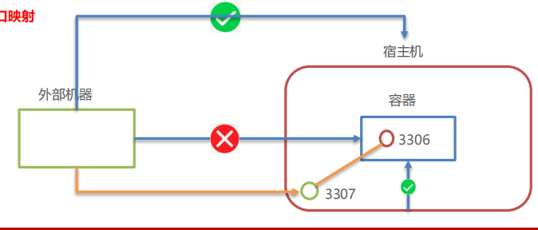

## 4.1、MySQL部署

在Docker容器中部署MySQL，并通过外部mysql客户端操作MySQL Server。

**开始部署**

1. 搜索mysql镜像

```shell
docker search mysql
```

2. 拉取mysql镜像

```shell
docker pull mysql:5.7
```

3. 创建容器，设置端口映射、目录映射

```shell
# 在/root目录下创建mysql目录用于存储mysql数据信息
mkdir ~/mysql
cd ~/mysql
```

```shell
# 在root/mysql目录下撒
docker run -id \
-p 3306:3306 \
--name=c_mysql \
-v $PWD/conf:/etc/mysql/conf.d \
-v $PWD/logs:/logs \
-v $PWD/data:/var/lib/mysql \
-e MYSQL_ROOT_PASSWORD=123456 \
mysql:5.7
```

- 参数说明：
  - **-p 3307:3306**：将宿主机的 3307 端口映射到容器的 3306 端口。
  - **-v $PWD/conf:/etc/mysql/conf.d**：将主机当前目录下的 conf/my.cnf 挂载到容器的 /etc/mysql/my.cnf。配置目录
  - **-v $PWD/logs:/logs**：将主机当前目录下的 logs 目录挂载到容器的 /logs。日志目录
  - **-v $PWD/data:/var/lib/mysql** ：将主机当前目录下的data目录挂载到容器的 /var/lib/mysql 。数据目录
  - **-e MYSQL_ROOT_PASSWORD=123456：**初始化 root 用户的密码。


4. 进入容器，操作mysql

```shell
docker exec -it c_mysql /bin/bash
```

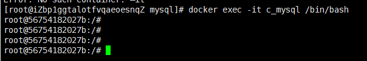

现在这里就相当于是我们Win启动Mysql的那个cmd命令行窗口了。

可以登录啊什么什么的

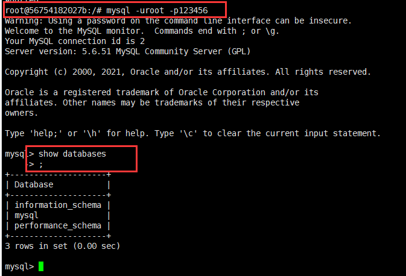

5. 使用Win的外部机器连接容器中的mysql

   注意哦：我们外部肯定只能链接宿主机的IP地址和端口，然后他会自己映射到我们内部mysql容器的端口。

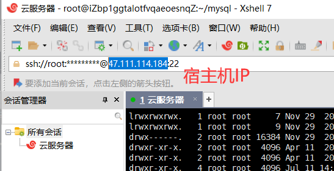

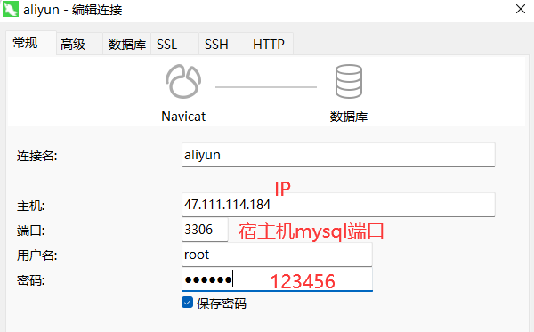

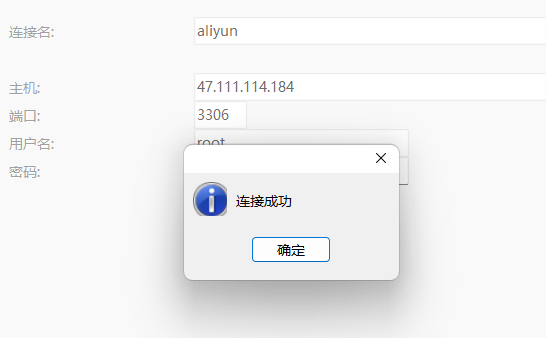

现在就可以操作我们Linux下Docker下的mysql容器了；

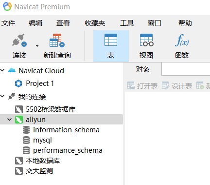


## 4.2、Tomcat部署

1. 搜索tomcat镜像

```shell
docker search tomcat
```

2. 拉取tomcat镜像

```shell
docker pull tomcat
```

3. 创建容器，设置端口映射、目录映射

```shell
# 在/root目录下创建tomcat目录用于存储tomcat数据信息
mkdir ~/tomcat
cd ~/tomcat
```

```shell
docker run -id --name=c_tomcat \
-p 8080:8080 \
-v $PWD:/usr/local/tomcat/webapps \
tomcat 
```

- 参数说明：

  - **-p 8080:8080：**将容器的8080端口映射到主机的8080端口

    **-v $PWD:/usr/local/tomcat/webapps：**将主机中当前目录挂载到容器的webapps


4. 使用外部机器访问tomcat

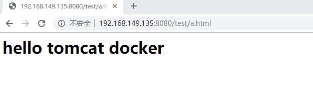

## 4.3、Nginx部署

1. 搜索nginx镜像

```shell
docker search nginx
```

2. 拉取nginx镜像

```shell
docker pull nginx
```

3. 创建容器，设置端口映射、目录映射


```shell
# 在/root目录下创建nginx目录用于存储nginx数据信息
mkdir ~/nginx
cd ~/nginx
mkdir conf
cd conf
# 在~/nginx/conf/下创建nginx.conf文件,粘贴下面内容
vim nginx.conf
```

nginx.conf的内容（xboot的）

```shell
#user  nobody;
worker_processes  1;

#error_log  logs/error.log;
#error_log  logs/error.log  notice;
#error_log  logs/error.log  info;

#pid        logs/nginx.pid;


events {
    worker_connections  1024;
}


http {
    include       mime.types;
    default_type  application/octet-stream;

    #log_format  main  '$remote_addr - $remote_user [$time_local] "$request" '
    #                  '$status $body_bytes_sent "$http_referer" '
    #                  '"$http_user_agent" "$http_x_forwarded_for"';

    #access_log  logs/access.log  main;

    sendfile        on;
    #tcp_nopush     on;

    #keepalive_timeout  0;
    keepalive_timeout  65;

    #gzip  on;

server {
    listen       9000;
    server_name  localhost;

    # Vue路由模式为history需添加的配置
    location / {
        if (!-e $request_filename) {
            rewrite ^(.*)$ /index.html?s=$1 last;
            break;
        }
        root   xboot;  # 要改成你前端项目放置的路径下（html）
        index  index.html;
    }

    location /xboot/ {
        proxy_pass http://47.111.114.184:8000;
    }
    location /doc.html {
        proxy_pass http://47.111.114.184:8000;
    }
    location /swagger-resources {
        proxy_pass http://47.111.114.184:8000;
    }
    location /webjars {
        proxy_pass http://47.111.114.184:8000;
    }
    location /v2 {
        proxy_pass http://47.111.114.184:8000;
    }
    location /druid {
        proxy_pass http://47.111.114.184:8000;
    }
    # 完整版Activiti工作流设计器以及机器人助手页面需加入以下配置
    location /chat {
        proxy_pass http://47.111.114.184:8000;
    }
    location /modeler {
        proxy_pass http://47.111.114.184:8000;
     }
    location /editor-app {
        proxy_pass http://47.111.114.184:8000;
    }
    # 以上为完整版需要加的反向代理转发路径规则

    # 获取真实IP以及Websocket需添加的配置
    proxy_set_header Host $host;
    proxy_set_header X-Real-IP $remote_addr;
    proxy_set_header REMOTE-HOST $remote_addr;
    proxy_set_header X-Forwarded-For $proxy_add_x_forwarded_for;
    proxy_set_header Upgrade $http_upgrade;
    proxy_set_header Connection "upgrade";
    
    # 客户端Body大小限制（文件上传大小限制配置）
    client_max_body_size 5m;

    error_page   500 502 503 504 404  /50x.html;
    location = /50x.html {
        root   html;
    }
}


    # another virtual host using mix of IP-, name-, and port-based configuration
    #
    #server {
    #    listen       8000;
    #    listen       somename:8080;
    #    server_name  somename  alias  another.alias;

    #    location / {
    #        root   html;
    #        index  index.html index.htm;
    #    }
    #}


    # HTTPS server
    #
    #server {
    #    listen       443 ssl;
    #    server_name  localhost;

    #    ssl_certificate      cert.pem;
    #    ssl_certificate_key  cert.key;

    #    ssl_session_cache    shared:SSL:1m;
    #    ssl_session_timeout  5m;

    #    ssl_ciphers  HIGH:!aNULL:!MD5;
    #    ssl_prefer_server_ciphers  on;

    #    location / {
    #        root   html;
    #        index  index.html index.htm;
    #    }
    #}

}

```


```shell
# 在root/nginx目录下啊
docker run -id --name=c_nginx \
-p 9000:9000 \
-v $PWD/conf/nginx.conf:/etc/nginx/nginx.conf \
-v $PWD/logs:/var/log/nginx \
-v $PWD/html:/usr/share/nginx/html \
nginx

docker run -id --name=frontxboot \
-p 9000:9000 \
-v $PWD/conf/nginx.conf:/etc/nginx/conf.d/default.conf \
-v $PWD/logs:/var/log/nginx \
-v $PWD/html:/usr/share/nginx/html \
frontxboot
```

- 参数说明：
  - **-p 80:80**：将容器的 80端口映射到宿主机的 80 端口。
  - **-v $PWD/conf/nginx.conf:/etc/nginx/nginx.conf**：将主机当前目录下的 /conf/nginx.conf 挂载到容器的 :/etc/nginx/nginx.conf。配置目录
  - **-v $PWD/logs:/var/log/nginx**：将主机当前目录下的 logs 目录挂载到容器的/var/log/nginx。日志目录

4. 使用外部机器访问nginx


## 4.4、Redis部署

1. 搜索redis镜像

```shell
docker search redis
```

2. 拉取redis镜像

```shell
docker pull redis:5.0
```

3. 创建容器，设置端口映射

```shell
docker run -id --name=c_redis -p 6379:6379 redis:5.0
```

4. 使用外部机器连接redis

   cmd窗口

```shell
./redis-cli.exe -h 192.168.149.135 -p 6379
```

​		RDM

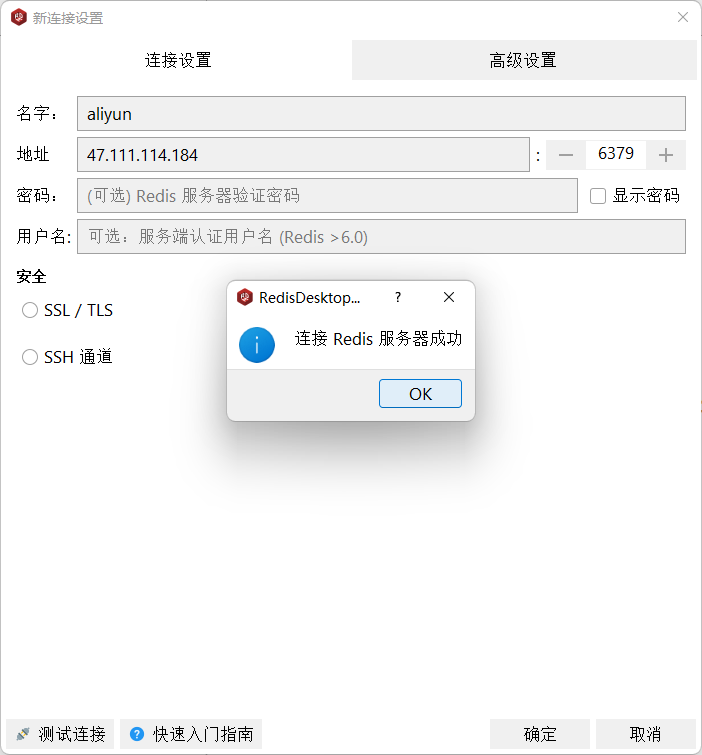

# 5、Dockerfile

## 5.1、镜像原理

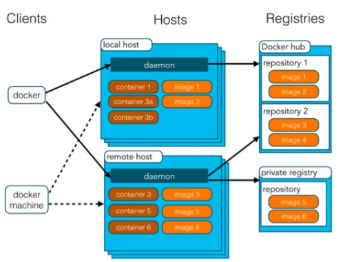

**思考：**

-  **Docker 镜像本质是什么？**

  ​	确实是一个文件，但不是一个普通文件！！！后面说

-  **Docker 中一个centos镜像为什么只有200MB，而一个centos操作系统的iso文件要几个个G？** 

- **Docker 中一个tomcat镜像为什么有500MB，而一个tomcat安装包只有70多MB？**

$\color{#FF69B4}{1、首先了解一下操作系统的组成部分：}$

​		• 进程调度子系统

​		• 进程通信子系统

​		• 内存管理子系统

​		• 设备管理子系统

​		• **文件管理子系统**

​		• 网络通信子系统

​		• 作业控制子系统

我们这里重点关注文件管理子系统：

**Linux文件系统由bootfs和rootfs两部分组成**

​	• bootfs：包含bootloader（引导加载程序）和 kernel（内核）

​	• rootfs： root文件系统，包含的就是典型 Linux 系统中的/dev，/proc，/bin，/etc等标准目录和文件

​	• 不同的linux发行版，bootfs基本一样，而rootfs不同，如ubuntu，centos等

$\color{#FF69B4}{2、docker镜像的原理}$

1. Docker镜像是由特殊的文件系统叠加而成

2. 最底端是 bootfs，并使用宿主机的bootfs（内核）

3. 第二层是 root文件系统rootfs, 称为base image

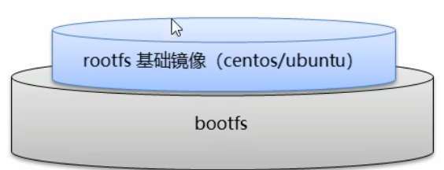

4. 然后再往上可以叠加其他的镜像文件；

   这三部份被称为只读镜像，对用户而言，我们只知道搞了一个Tomcat镜像，但Tomcat依赖于下面两个镜像，他会在下载Tomcat时自动去搜索，假如有了就直接在上面叠加，没有就先下载；这样做的好处就是：**复用**；

   解释一下：就是说，我们现在在下图的基础上，要加一个Nginx镜像，Nginx是依赖于基础镜像撒，但现在已经被下载过了，所以我们就直接下载顶部的Nginx镜像就好了

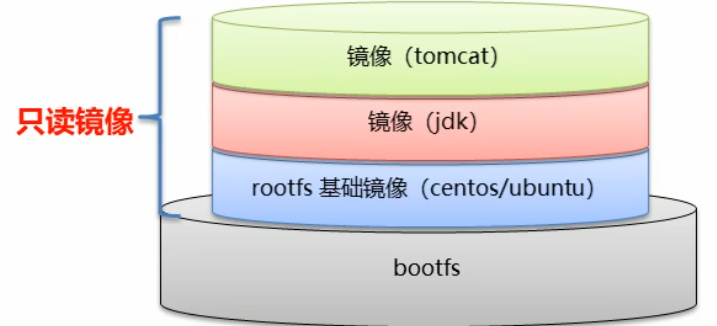

5. 统一文件系统（Union File System）技术能够将不同的层整合成一个文件系统，为这些层提供了一个统一的视角，这样就隐藏了多层的存在，在用户的角度看来，只存在一个文件系统。

6. 一个镜像可以放在另一个镜像的上面。位于下面的镜像称为父镜像，最底部的镜像成为基础镜像。

7. **只读镜像不可以改！！那我们需要自己配置Tomcat类似的怎么办？？？**

   有办法，通过容器！！！当从一个镜像启动容器时，Docker会在最顶层加载一个读写文件系统作为容器，我们可以在这个容器里面修改，然后把这个容器又作为一个新的镜像！！！

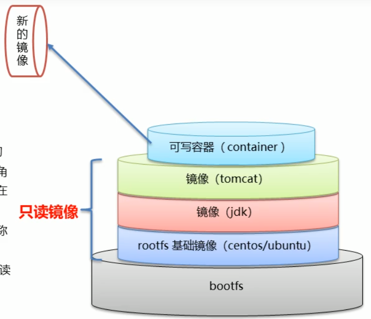

-  **Docker 镜像本质是什么？**

  ​    是一个分层文件系统

-  **Docker 中一个centos镜像为什么只有200MB，而一个centos操作系统的iso文件要几个个G？** 

  ​    Centos的iso镜像文件包含bootfs和rootfs，而docker的centos镜像复用操作系统的bootfs，只有rootfs和其他镜像层

- **Docker 中一个tomcat镜像为什么有500MB，而一个tomcat安装包只有70多MB？**

  ​    由于docker中镜像是分层的，tomcat虽然只有70多MB，但他需要依赖于父镜像和基础镜像，所有整个对外暴露的tomcat镜像大小500多MB

##  5.2、镜像制作

**1、容器转镜像**

```sh
docker commit 容器id 镜像名称:版本号
```

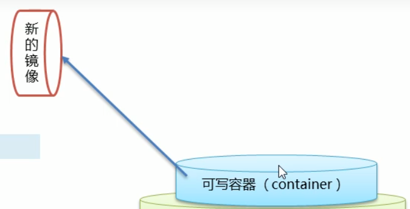

**2、压缩镜像**

镜像本事是不可以传给别人的，所以要压缩，就可以了；例如开发转给测试

```
docker save -o 压缩文件名称 镜像名称:版本号
```

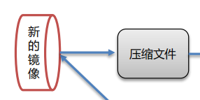

**3、还原镜像**

测试人员拿到后，要把压缩的镜像还原进行使用；

```
docker load –i 压缩文件名称
```

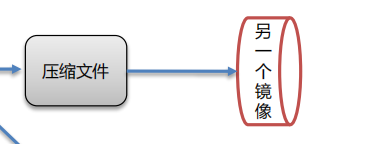

**Example:**

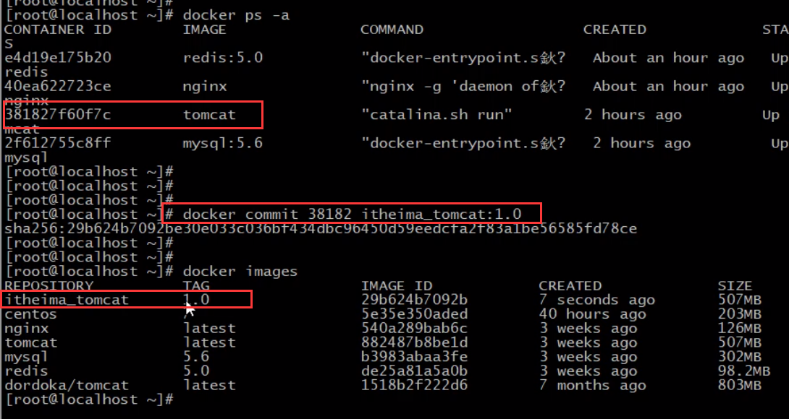

## 5.3、Dockerfile

1.  Dockerfile 是一个文本文件
2. 包含了一条条的指令
3.  每一条指令构建一层，基于基础镜像，最终构建出一个新的镜像
4. 对于开发人员：可以为开发团队提供一个完全一致的开发环境
5. 对于测试人员：可以直接拿开发时所构建的镜像或者通过Dockerfile文件构建一个新的镜像开始工作了
6. 对于运维人员：在部署时，可以实现应用的无缝移植

Dockerfile有超级多的指令，不可能全部背下来，要用的时候我们去官网看一下：Dochub网址：https://hub.docker.com，上面有很多Nginx，等等的范例


| DF关键字    | 作用                     | 备注                                                         |
| ----------- | ------------------------ | ------------------------------------------------------------ |
| FROM        | 指定父镜像               | 指定dockerfile基于那个image构建                              |
| MAINTAINER  | 作者信息                 | 用来标明这个dockerfile谁写的                                 |
| LABEL       | 标签                     | 用来标明dockerfile的标签 可以使用Label代替Maintainer 最终都是在docker image基本信息中可以查看 |
| RUN         | 执行命令                 | 执行一段命令 默认是/bin/sh 格式: RUN command 或者 RUN ["command" , "param1","param2"] |
| CMD         | 容器启动命令             | 提供启动容器时候的默认命令 和ENTRYPOINT配合使用.格式 CMD command param1 param2 或者 CMD ["command" , "param1","param2"] |
| ENTRYPOINT  | 入口                     | 一般在制作一些执行就关闭的容器中会使用                       |
| COPY        | 复制文件                 | build的时候复制文件到image中                                 |
| ADD         | 添加文件                 | build的时候添加文件到image中 不仅仅局限于当前build上下文 可以来源于远程服务 |
| ENV         | 环境变量                 | 指定build时候的环境变量 可以在启动的容器的时候 通过-e覆盖 格式ENV name=value |
| ARG         | 构建参数                 | 构建参数 只在构建的时候使用的参数 如果有ENV 那么ENV的相同名字的值始终覆盖arg的参数 |
| VOLUME      | 定义外部可以挂载的数据卷 | 指定build的image那些目录可以启动的时候挂载到文件系统中 启动容器的时候使用 -v 绑定 格式 VOLUME ["目录"] |
| EXPOSE      | 暴露端口                 | 定义容器运行的时候监听的端口 启动容器的使用-p来绑定暴露端口 格式: EXPOSE 8080 或者 EXPOSE 8080/udp |
| WORKDIR     | 工作目录                 | 指定容器内部的工作目录 如果没有创建则自动创建 如果指定/ 使用的是绝对地址 如果不是/开头那么是在上一条workdir的路径的相对路径 |
| USER        | 指定执行用户             | 指定build或者启动的时候 用户 在RUN CMD ENTRYPONT执行的时候的用户 |
| HEALTHCHECK | 健康检查                 | 指定监测当前容器的健康监测的命令 基本上没用 因为很多时候 应用本身有健康监测机制 |
| ONBUILD     | 触发器                   | 当存在ONBUILD关键字的镜像作为基础镜像的时候 当执行FROM完成之后 会执行 ONBUILD的命令 但是不影响当前镜像 用处也不怎么大 |
| STOPSIGNAL  | 发送信号量到宿主机       | 该STOPSIGNAL指令设置将发送到容器的系统调用信号以退出。       |
| SHELL       | 指定执行脚本的shell      | 指定RUN CMD ENTRYPOINT 执行命令的时候 使用的shell            |

# 6、发布SP+vue项目

我们部署前后端分离项目在Linux下的文件目录结构统一为：

在root下新建`xboot`文件夹，`xboot`下新建`front`目录和`back`目录；

- front——放前端部署文件；
- back——放后端部署文件；

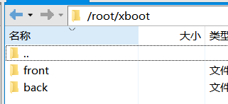

```
mkdir xboot
```

## **6.1、后端运行环境部署**

xboot项目需要Mysq、Redis、Java8三个环境，Java8不用提前安装，dockerfile写了会自动安装；

**Mysql的安装前面有，按着那个来，注意持久化存储的位置！！！！**

**Redis不需要持久化存储，这个简单，一下子就好了，按照前面来！！！**

==注意注意==：坑点来了，这里相当于我们后端项目、Mysql、Redis在三个不同的容器，他们之间是不可以通信的，必须通过宿主机对外IP地址来通信！！！就是说我们后端yml文件要把mysql和Redis的host改为现在的Linux的IP地址；

## 6.2、后端部署

**1、打包springboot项目为jar包，注意跳过测试哦**

**2、jar包传到服务器 root/xboot/back下**

**3、back目录下新建编辑Dockerfile文件**

```sh
vim back_dockerfile	# 新建文件
```

```sh
# 输入以下内容
# 定义父镜像
FROM java:8  
# 定义作者信息
MAINTAINER ZHOUQUAN <123@QQ.COM>  
# VOLUME 指定临时文件目录为/tmp 在主机 /var/lib/docker 目录下创建了一个临时文件，并链接到容器的/tmp
VOLUME /tmp   
# 将jar包添加到容器中并更名为xboot.jar
ADD xboot.jar xboot.jar 
# 运行jar包
CMD java -jar xboot.jar
```

这样后端部署的文件就全部到位了！！

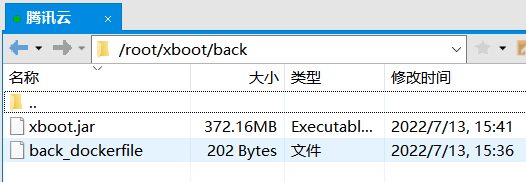

**5、通过dockerfile构建镜像**

```sh
docker bulid –f dockerfile文件路径 –t 镜像名称:版本 .# 版本不写就是latest

docker build -f back_dockerfile -t backxboot . #最后这个点.必须要
```

**6、启动容器**

```sh
 # -p指定端口映射 # -v将后端输出的日志文件绑定d
docker run -id \
-p 8000:8000 \
--name=backxboot \
-v $PWD/xbootlog:/xboot-logs \
backxboot  

 # -p指定端口映射 # -v将后端输出的日志文件绑定d
docker run -id \
-p 8000:8000 \
--name=backxboot \
-v $PWD/xbootlog:/xboot-logs \
-v $PWD/DataAnalysis:/DataAnalysis \
-v $PWD/ProgramData:/ProgramData \
-v $PWD/report:/report \
backxboot 
```

**7、查看容器日志**

```sh
docker logs -ft backxboot  # 实时查看所有的日志信息
docker logs -ft --tail 50 backxboot  # 查看容器近50条日志信息
```

**8、测试访问**

访问：http://47.111.114.184:8000

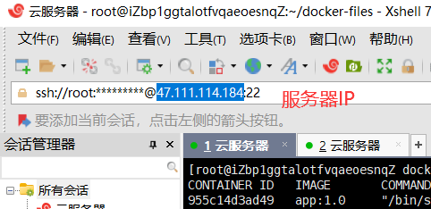

### **1. 问题排查**

假如访问不了，就按照下面进行问题排查，最好先拿一个简单的sp项目跑通先：

**1、排除docker内部的原因**

```sh
# 1、先在容器内部测试
docker exec -it backxboot bash
curl localhost:8000 # xboot这样访问没有回写数据看不出来，可以先拿一个简单的sp项目跑通先
ping www.baidu.com  # 随便ping一下，看网络通不

# 2、在宿主机测试
exit
curl localhost:8000  # 端口映射是8000:8000
ping www.baidu.com
```

这里假如都ok的话，就说明服务启动没问题了，是外网不能访问；

**2、解决外部访问问题**

1. 关闭Linux防火墙（访问暴露的IP地址需要经过防火墙）

```sh
systemctl status firewalld  # 查看防火墙状态
systemctl stop firewalld  # 关闭防火墙
systemctl disable firewalld  # 关闭防火墙的开机启动
```

2. 阿里云服务器需要在控制台安全组开放宿主机的端口号；
3. 阿里云服务器与docker虚拟网卡冲突，都是172网段

```sh
idconfig  # 查看宿主机的网卡
```

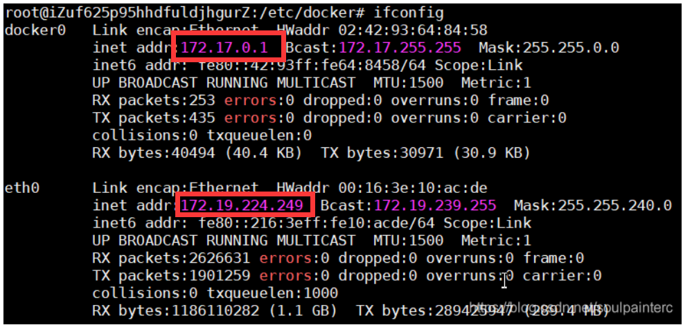

发现阿里云的[内网](https://so.csdn.net/so/search?q=内网&spm=1001.2101.3001.7020)eth0 网段正好跟Docker 的虚拟网卡都是 172 网段,有冲突.

 ```sh
 # 修改docker的网卡
 vim /etc/docker/daemon.json
 # 在里面加入下面一行
 "bip": "192.168.1.5/24",
 ```

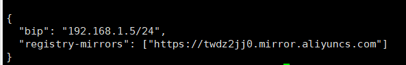

```sh
# 重启docker
systemctl restart docker
```

## 6.2、前端部署

前端环境是Nginx；我们需要自己写好路由跳转的配置文件；现在有两种部署方式，效果是一样的！！！

注意要点：

1. 我们前端打包文件夹dist下的内容要全部复制到nginx容器根目录下html文件夹下

2. nginx容器里面有两个配置文件，一个是`/etc/nginx/nginx.conf` ，一个是`/etc/nginx/conf.d/default.conf`，

   区别在于：第一个是正常的完全空的配置文件；第二个是默认的配置文件模板，这个里面已经帮我们把前面的`http{ }等结构`写好了，我们只要写`server{......}`里面的内容

前端打包：`npm run build`

### **1. 无数据卷**

这里用default.conf或者nginx.conf都是一样的，随便选；

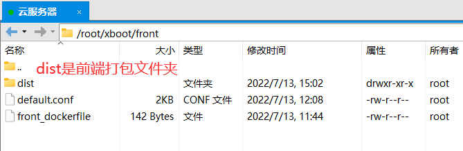

**1、Dockerfile**

```sh
vim front_dockerfile  # 也可以用xftp的用记事本打开还好用一点
```

```sh
FROM nginx  # 父镜像
MAINTAINER zouzou
RUN rm /etc/nginx/conf.d/default.conf  # 删除default.conf
ADD default.conf /etc/nginx/conf.d/  # 当前目录下default.conf复制到...
COPY dist/ /usr/share/nginx/html/  # 当前dits目录下的文件放到nginx的html下
```

**2、default.conf：只要写server内容**

```
vim default.conf
```

```sh
server {
    listen       9000;
    server_name  localhost;

    # Vue路由模式为history需添加的配置
    location / {
        if (!-e $request_filename) {
            rewrite ^(.*)$ /index.html?s=$1 last;
            break;
        }
        root   /usr/share/nginx/html/;  # 要改成你前端项目放的地方
        index  index.html;
    }

    location /xboot/ {
        proxy_pass http://47.111.114.184:8000;  # 改成后端访问地址
    }
    location /doc.html {
        proxy_pass http://47.111.114.184:8000;
    }
    location /swagger-resources {
        proxy_pass http://47.111.114.184:8000;
    }
    location /webjars {
        proxy_pass http://47.111.114.184:8000;
    }
    location /v2 {
        proxy_pass http://47.111.114.184:8000;
    }
    location /druid {
        proxy_pass http://47.111.114.184:8000;
    }
    # 完整版Activiti工作流设计器以及机器人助手页面需加入以下配置
    location /chat {
        proxy_pass http://47.111.114.184:8000;
    }
    location /modeler {
        proxy_pass http://47.111.114.184:8000;
     }
    location /editor-app {
        proxy_pass http://47.111.114.184:8000;
    }
    # 以上为完整版需要加的反向代理转发路径规则

    # 获取真实IP以及Websocket需添加的配置
    proxy_set_header Host $host;
    proxy_set_header X-Real-IP $remote_addr;
    proxy_set_header REMOTE-HOST $remote_addr;
    proxy_set_header X-Forwarded-For $proxy_add_x_forwarded_for;
    proxy_set_header Upgrade $http_upgrade;
    proxy_set_header Connection "upgrade";
    
    # 客户端Body大小限制（文件上传大小限制配置）
    client_max_body_size 5m;

    error_page   500 502 503 504 404  /50x.html;
    location = /50x.html {
        root   html;
    }
}
```

**3、创建镜像**

```sh
docker build -f front_dockerfile -t frontxboot .
```

**4、创建启动容器**

```sh
docker run -id --name=frontxboot -p 9000:9000 frontxboot
```

**5、查看日志**

```sh
docker logs -ft frontxboot  # 实时查看所有的日志信息
docker logs -ft --tail 50 frontxboot  # 查看容器近50条日志信息
```

**6、测试访问**

这里一般就可以了，后端部署ok的话；

访问：http://47.111.114.184:9000

### 2. 有数据卷(推荐)

这种方式我们dockerfile就一句话就行了，主要在我们创建容器的时候绑定数据卷信息；

**新建文件夹html：**将dist目录下的文件复制到html目录下

**新建文件夹logs：**空

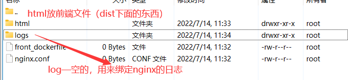

**1、Dockerfile**

```
vim front_dockerfile
```

```
FROM nginx
MAINTAINER zouzou
```

**2、nginx.conf**

因为改的是`/etc/nginx/nginx.conf`，需要全部内容

```
vim nginx.conf
```

```sh
#user  nobody;
worker_processes  1;

#error_log  logs/error.log;
#error_log  logs/error.log  notice;
#error_log  logs/error.log  info;

#pid        logs/nginx.pid;


events {
    worker_connections  1024;
}


http {
    include       mime.types;
    default_type  application/octet-stream;

    #log_format  main  '$remote_addr - $remote_user [$time_local] "$request" '
    #                  '$status $body_bytes_sent "$http_referer" '
    #                  '"$http_user_agent" "$http_x_forwarded_for"';

    #access_log  logs/access.log  main;

    sendfile        on;
    #tcp_nopush     on;

    #keepalive_timeout  0;
    keepalive_timeout  65;

    #gzip  on;

server {
    listen       9000;
    server_name  localhost;

    # Vue路由模式为history需添加的配置
    location / {
        if (!-e $request_filename) {
            rewrite ^(.*)$ /index.html?s=$1 last;
            break;
        }
        root   /usr/share/nginx/html/;   # 要改成你前端项目放置的路径下（html）
        index  index.html;
    }

    location /xboot/ {
        proxy_pass http://139.155.243.51:8000;
    }
    location /doc.html {
        proxy_pass http://139.155.243.51:8000;
    }
    location /swagger-resources {
        proxy_pass http://139.155.243.51:8000;
    }
    location /webjars {
        proxy_pass http://139.155.243.51:8000;
    }
    location /v2 {
        proxy_pass http://139.155.243.51:8000;
    }
    location /druid {
        proxy_pass http://139.155.243.51:8000;
    }
    # 完整版Activiti工作流设计器以及机器人助手页面需加入以下配置
    location /chat {
        proxy_pass http://139.155.243.51:8000;
    }
    location /modeler {
        proxy_pass http://139.155.243.51:8000;
     }
    location /editor-app {
        proxy_pass http://139.155.243.51:8000;
    }
    # 以上为完整版需要加的反向代理转发路径规则

    # 获取真实IP以及Websocket需添加的配置
    proxy_set_header Host $host;
    proxy_set_header X-Real-IP $remote_addr;
    proxy_set_header REMOTE-HOST $remote_addr;
    proxy_set_header X-Forwarded-For $proxy_add_x_forwarded_for;
    proxy_set_header Upgrade $http_upgrade;
    proxy_set_header Connection "upgrade";
    
    # 客户端Body大小限制（文件上传大小限制配置）
    client_max_body_size 5m;

    error_page   500 502 503 504 404  /50x.html;
    location = /50x.html {
        root   html;
    }
}


    # another virtual host using mix of IP-, name-, and port-based configuration
    #
    #server {
    #    listen       8000;
    #    listen       somename:8080;
    #    server_name  somename  alias  another.alias;

    #    location / {
    #        root   html;
    #        index  index.html index.htm;
    #    }
    #}


    # HTTPS server
    #
    #server {
    #    listen       443 ssl;
    #    server_name  localhost;

    #    ssl_certificate      cert.pem;
    #    ssl_certificate_key  cert.key;

    #    ssl_session_cache    shared:SSL:1m;
    #    ssl_session_timeout  5m;

    #    ssl_ciphers  HIGH:!aNULL:!MD5;
    #    ssl_prefer_server_ciphers  on;

    #    location / {
    #        root   html;
    #        index  index.html index.htm;
    #    }
    #}

}
```

**3、创建镜像**

```sh
docker build -f front_dockerfile -t frontxboot .
```

**4、创建启动容器，重点是这里**

-v ——一定是绝对路径才行哦

$PWD——获取当前绝对路径

```sh
# 当前目录的nginx.conf绑定到容器内的....
# 当前目录下的logs目录绑定到容器下这个日志目录
# 当前html目录下文件绑定到容器内html目录下
docker run -id --name=frontxboot \
-p 9000:9000 \
-v $PWD/nginx.conf:/etc/nginx/nginx.conf \
-v $PWD/logs:/var/log/nginx \
-v $PWD/html:/usr/share/nginx/html \
frontxboot
```

==这样的好处就是，每次我要改一下前端文件、nginx配置信息的话，就不用再重新创建镜像创建容器了，直接先停止stop容器，然后改现在宿主机内的内容，再start容器；==不相信的话，可以`cat /etc/nginx/nginx.conf`一下

**5、查看日志**

```sh
docker logs -ft frontxboot  # 实时查看所有的日志信息
docker logs -ft --tail 50 frontxboot  # 查看容器近50条日志信息
```

**6、测试访问**

这里一般就可以了，后端部署ok的话；

访问：http://47.111.114.184:9000


## 6.3、端口占用

1. 查询端口

   ```
   netstat -tln | grep 8080
   ```

2. 查看端口被哪个进程占用

   ```
   lsof -i:9000
   ```

3. 杀死进程

   ```
   kill -9 进程id
   ```


## 6.4、删除目录

```sh
rm -rf 目录的路径
```


